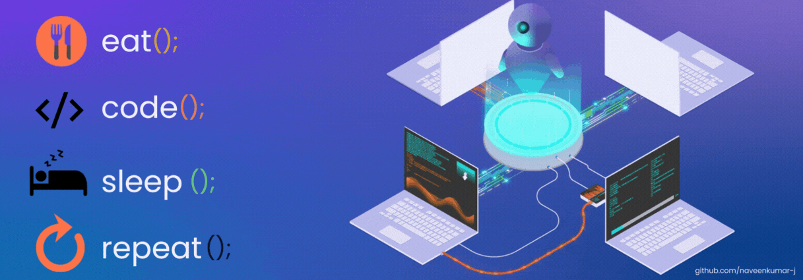

<!-- Banner (abc.gif same repo me hai isliye relative path use kiya — agar banner nahi chahiye to ye block hata do) -->

  

<h1 align="center">Hi 👋, I'm Isha Patil</h1>
<h3 align="center">Full Stack Developer · MERN & Next.js · E-commerce & CMS Platforms</h3>

  

  

## 🙋‍♀️ About Me

- 🚀 **1.5+ years** shipping production apps — from **B2B e-commerce** to **multi-site CMS**
- 💼 Currently building a CMS powering **8 NGO websites & 1,000+ monthly users**
- 🛒 Shipped a **B2B e-commerce platform end-to-end** — catalog → cart → checkout → delivery tracking
- ⚡ Designed **70+ REST APIs** with JWT auth, RBAC & real-time inventory sync (WebSockets)
- 💬 Ask me about **MERN, Next.js, REST API design, DSA**
- 📫 Reach me: **ishapatil298@gmail.com**
- ⚡ Fun fact: shipped for **NGO, fintech & e-commerce** — all before year 2 as a developer

 

## 🛠️ Tech Stack

#### Frontend

  
  
  
  
  
  
  
  

#### Backend

  
  
  
  
  
  

#### Databases

  
  
  

#### DevOps & Tools

  
  
  
  
  
  
  
  

## 🚀 Featured Projects

<!-- ⚠️ REPO-NAME ko apne actual repo names se replace karo -->

| Project | Tech | Highlights |
|---------|------|------------|
| **[BulkMailer — Bulk Email Tool](https://github.com/PatilIsha/REPO-NAME)** | React + Vite, Node.js, Express, Brevo API | Multi-recipient sending, per-recipient delivery tracking, PDF attachments up to 25MB, draft auto-save |
| **[Professional Service Provider](https://github.com/PatilIsha/REPO-NAME)** | React, Java, Spring Boot, MySQL | Home-services booking platform, 15+ categories, JWT auth, Lighthouse 90+ score |
| **OneATM — DMT Module** *(client work · live)* | Next.js, Node.js | Fintech money transfer — OTP + KYC onboarding per RBI guidelines, IMPS/NEFT integration |

## 💻 Coding Profiles

  
  
  

## 🤝 Connect With Me

  
  
  
  

## 📊 GitHub Stats

  

  
  

  

  

---

<h4 align="center">⭐ Building things that ship — one commit at a time.</h4>
